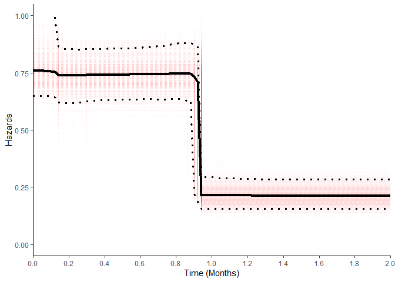
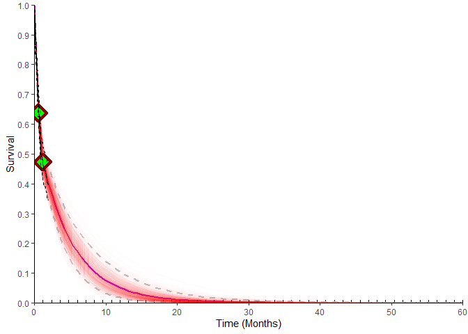
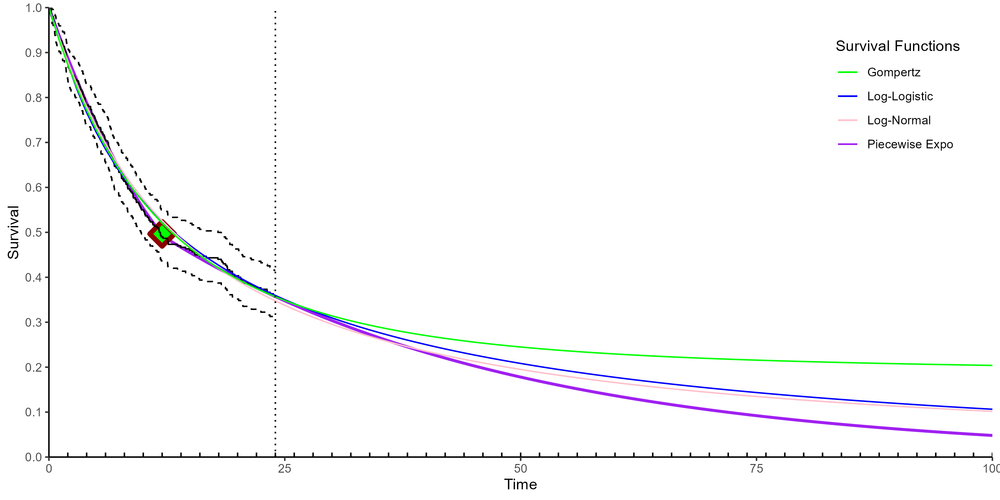
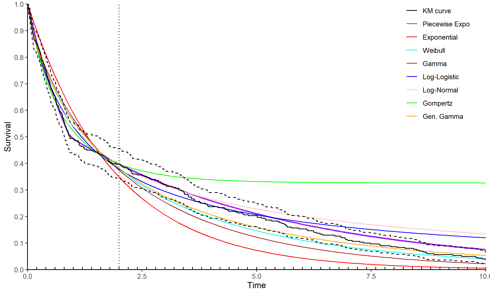
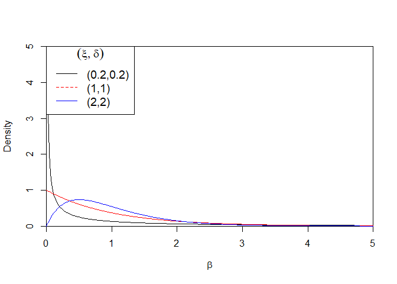

README
================

# Overview of PiecewiseChangepoint package

<!-- bookdown::html_document2: default -->
<!-- bookdown::pdf_document: default -->

The goal of PiecewiseChangepoint is to estimate the number and locations
of change-points in piecewise exponential models.

## Installation

You can install the released version of PiecewiseChangepoint from
[GitHub](https://github.com/Anon19820/PiecewiseChangepoint) with:

``` r
devtools::install_github("Anon19820/PiecewiseChangepoint")
```

In order to run some of the functions JAGS and Stan are required along
with RTools.

## Simulated Example

First we load the package and simulate some piecewise exponential data.

    library("PiecewiseChangepoint")

    ## simulated example
    set.seed(123)
    n_obs =300
    n_events_req=300
    max_time =  24 # months

    rate = c(0.75,0.25)/12 # we want to report on months
    t_change =12 # change-point at 12 months

    df <- gen_piece_df(n_obs = n_obs,n_events_req = n_events_req,
                       num.breaks = length(t_change),rate = rate ,
                       t_change = t_change, max_time = max_time)
                       

We see the output of this dataframe below:

    ##     time_event status       time
    ## 24  0.09194727      1 0.09194727
    ## 193 0.23141129      1 0.23141129
    ## 87  0.24251702      1 0.24251702
    ## 126 0.25450622      1 0.25450622
    ## 297 0.28833655      1 0.28833655
    ## 139 0.32615105      1 0.32615105

For this simulated dataset; *time_event* represents the time the event
would occur at in the absence of censoring, while *time* is minimum of
the censoring time and the event time. *status* is an indicator variable
if the event occurred at the corresponding time or if it was censored.
Plotting this survival function we see a potential change in the hazard
at around year 1.

<!-- -->

As noted in ([Bagust and Beale 2014](#ref-Bagust.2014)), constant
hazards are linear with respect to the cumulative hazard function,
therefore, the change in hazards at approximately 12 months can be seen
more clearly in this plot.

``` r
ggsurvplot(fit, palette = "#2E9FDF", fun = "cumhaz")
```

<!-- -->

Next we fit the model noting that only the time and status columns are
required. The timescale argument changes the prior for the hazards
$\lambda$ so that it is appropriate for the timescale. For example if
the timescale is years then the a vague prior centered around 1 is
appropriate (i.e. $36\%$ of population having the event each year),
while if the timescale is in months the equivalent prior should have an
expected value of 1/12 (and days 1/365).


    Collapsing_Model <- collapsing.model(df,
                                         n.iter = 20750,
                                         burn_in = 750,
                                         n.chains = 2,
                                         timescale = "months")

                          

As we would expect the one change-point model has the highest posterior
probability.

    print(Collapsing_Model)

``` r
print(Collapsing_Model)
```

    ## Posterior Change-point Probabilities:
    ##        1         2         3         4         5         6  
    ## 0.720600  0.219825  0.050400  0.007950  0.000950  0.000275  
    ## 
    ## Summary of 1 change-point model:
    ## 
    ##   changepoint_1     lambda_1          lambda_2        
    ##   Min.   :0.7651    Min.   :0.4822    Min.   :0.0964  
    ##   1st Qu.:0.9196    1st Qu.:0.7078    1st Qu.:0.1880  
    ##   Median :0.9318    Median :0.7486    Median :0.2133  
    ##   Mean   :0.9252    Mean   :0.7507    Mean   :0.2159  
    ##   3rd Qu.:0.9318    3rd Qu.:0.7917    3rd Qu.:0.2409  
    ##   Max.   :1.2486    Max.   :1.0568    Max.   :0.4006

Simulations from the posterior distribution for the change-point
locations and associated hazards can be extracted from the returned
object (highlighted below).

``` r
Collapsing_Model$changepoint
Collapsing_Model$lambda
```

<!-- We should investigate the mixing of the chains to ensure they are satisfactory. The plot below indicates that is the case with jumps between models occurring frequently. This is an advantage of the method as other methods such as Reversible Jump Markov Chain Monte Carlo (RJMCMC) [@Green.1995] require careful consideration of a bijective function to move between model dimensions. Often it is difficult to find such an appropriate bijective function which provides frequent jumps between models and therefore convergence can be quite slow.    -->
<!-- ```{r} -->
<!-- chain.mixing(Collapsing_Model) -->
<!-- ``` -->

Once we are satisfied that there is good mixing and that we have run the
model for long enough (20,000 simulations over 2 chains should be more
than enough), we may want to look at a plot of the survivor function. In
health economics we are typically interested in long term survival of
our parametric models. In this situation we want a plot of the first 5
years which we can do using the *max_predict* argument (in this case 60
months). The red lines show the individual posterior simulations and are
a natural representation of the parameter uncertainty.

``` r
plot(Collapsing_Model, max_predict = 60, chng.num = 1)+xlab("Time (Months)")
```

<!-- -->

Similarly we may also want to look at the hazard function. In this
situation we only present the hazard up to the maximum time observed in
the data. This is because by definition the hazard from the final
interval will be the one which is extrapolated throughout the time
horizon.

``` r
plot(Collapsing_Model, type = "hazard")+xlab("Time (Months)")+ylab("Hazards")+ylim(c(0,1))
```

    ## Scale for y is already present.
    ## Adding another scale for y, which will replace the existing scale.

    ## Warning: Removed 186 rows containing missing values (`geom_step()`).

    ## Warning: Removed 6 rows containing missing values (`geom_line()`).

<!-- -->

By default the plot methods described above use all the posterior
simulations. If for example, we were only interested in the 2
change-point model, we can specify this using the *chng.num* argument.
The green points indicate the mean location of the change-points. When
plotting “all” of the simulations there is no sensible mean location of
the change-points as there are different numbers of change-points.

``` r
plot(Collapsing_Model, max_predict = 60, chng.num = 2)+xlab("Time (Months)")
```

<!-- -->

In practical health economic modelling, we require evaluation of the
survival function. Assuming time $t$ is within the $j^{\text{th}}$
interval we have calculate the cumulative hazard for this interval as
$\lambda_j (t - \tau_{j-1})$ with $\tau_{j-1}$ being the
${j-1}^{\text{th}}$ change-point and $\lambda_j$ the $j^{\text{th}}$
hazard. We also require the cumulative hazard for all the previous
intervals which is $\sum_{g=1}^{j-1} \lambda_g(\tau_g - \tau_{g-1})$.
The survival probability is the exponential of the negative of the total
cumulative hazard $S(t) = \exp(-H(t))$ and is written fully as:

$$S(t) = \exp\{- [\lambda_j (t - \tau_{j-1}) + \sum_{g=1}^{j-1} \lambda_g(\tau_g - \tau_{g-1}) ] \}.$$
It is programmatically straightforward to calculate this and the the
function `get_Surv` evaluates the survival at a vector of user specified
times. The user can specific an additional argument `chng.num` if they
require survival probabilities from a particular change-point number.

    St_all <- get_Surv(Collapsing_Model, time = c(0:10))
    St_all <- get_Surv(Collapsing_Model, time = c(0:10), chng.num = 1)

Given that the primary

## Comparison with other survival models

### Assessment of Goodness of Fit

In health economics we are typically interested in picking between one
of a number of alternative parametric models, although it is also
possible to combine all models using model averaging ([Jackson,
Sharples, and Thompson 2010](#ref-Jackson.2010)). Model fit statistics
can provide an assessment of fit to the **observed** data, although,
they do not guarantee the best fitting model will be appropriate for
extrapolation. Nevertheless, we can compare our fitted model with 6
commonly used parametric models along with Royston-Parmar spline models.
We fit the models using the JAGS ([Plummer 2003](#ref-Plummer.2003)) and
Stan ([**RStan.2023?**](#ref-RStan.2023)) and compare the model fit
using Widely Applicable Information Criterion (WAIC) ([Watanabe
2010](#ref-Watanabe.2010)).

### Including General Population Mortality

Including General Population Mortality (GPM) is required to ensure that
the extrapolated hazards are consistent with the increasing hazards
associated with advanced ageing. Adjustments for GPM is typically done
within the cost-effectiveness model, however, we can include them
directly at the analysis stage so that we see their impact on the
extrapolated survival.

In this example we consider GPM from a UK data source which provides
mortality rates, defined as “the probability of that a person aged
exactly $x$ will die before reaching $x+1$. Therefore, this data source
provides the conditional probability of death within a year at each age.

Assuming our population is $50%$ male and female and the age at baseline
is 55 years we have the following conditional probabilities of death at
each age:

``` r
age_baseline_example <- 55
prop_male <- 0.5
time_horizon <- 100 

Conditional_Death_df <- read.xlsx("Examples/Conditional_Death_UK.xlsx", 1) %>% 
                          filter(age >=age_baseline_example)
head(Conditional_Death_df)
```

    ##   age Males..2018.2020. Females.2018.2020
    ## 1  55          0.005046          0.003283
    ## 2  56          0.005593          0.003637
    ## 3  57          0.006060          0.003928
    ## 4  58          0.006695          0.004367
    ## 5  59          0.007239          0.004707
    ## 6  60          0.007912          0.005247

Our timescale is months and we need to convert this annual probability
to a monthly rate which is done using the following formula (assuming a
constant rate of mortality) ([Fleurence and Hollenbeak
2007](#ref-Fleurence.2007)):

$$r = \frac{1}{t}\ln(1-p).$$ Because there are 12 months in a year
$t = 12$ and $p$ is the specific (in our case annual) probability of
death. With the below R code we now have the monthly rate of death for
ages 55 (our assumed starting age of the cohort) up to 100 years of age,
adjusted for distribution of males and females.

``` r
time_factor <- 12
df_temp <- Conditional_Death_df
df_temp[, "mix_prob"] <- df_temp[,2]*prop_male + df_temp[,3]*(1-prop_male)
df_temp <- df_temp %>% filter(age >= age_baseline_example & age <= time_horizon)

df_temp$mix_haz <- -log(1-df_temp$mix_prob)/time_factor

gmp_haz_vec_example = rep(df_temp$mix_haz,each = time_factor)
#We now have the hazard at each timepoint
gmp_haz_df_example <- data.frame(time = 1:length(gmp_haz_vec_example),
                                 hazard = gmp_haz_vec_example)
```

Within the `compare.surv.mods` function the cumulative hazard of death
(associated with GPM) and cumulative hazard of an event (from the
parametric model) is added to obtain the overall cumulative hazard
$H(t)$. The cumulative hazard is the sum (in the case of discrete
hazards as above) of the individual hazards and the integral of the
parametric hazards. As noted in the previous section survival
probabilities are obtained through the relation $S(t) = \exp(-H(t))$. By
default the `compare.surv.mods` function only implements GPM hazards
after follow-up as we observe survival from all causes up until then
(although GPM hazards can be added from start of follow-up by using the
`gpm_post_data = FALSE`).

We see in the plot below that including the GPM hazard ensures that the
extrapolated hazard exhibits the characteristic increasing hazards
associated with ageing.

<div class="figure" style="text-align: center">


<p class="caption">
Overview of all TAs investigated
</p>

</div>

### Fitting of Standard Parametric models and Plot of Extrapolated Survival

The fitting of other parametric models is accomplished by the
`compare.surv.mods` and general population mortality is adjusted for by
including a `gmp_haz_df` as described above. Fitted models include:

-   Exponential
-   Weibull
-   Gamma
-   Gompertz
-   Generalized Gamma
-   Royston-Parmar Spline (best fitting by WAIC between 1 and 2 knot)

Model fit to the observed data and a plot of the extrapolated survival
are available from within the `mod_comp` object along with the posterior
samples from all of the fitted models.

``` r
#This can take a number of minutes 
set.seed(123)
mod_comp <- compare.surv.mods(Collapsing_Model,
                              max_predict = 100, #100 months
                              n.iter.jags = 5000, #Run JAGS/Stan for 5000 samples
                              n.thin.jags = 1,
                              n.burnin.jags = 500,
                              chng.num = 1, #Using results from 1 change-point PEM
                              gmp_haz_df =gmp_haz_df_example) #GPM dataset 

mod_comp$mod.comp[,c(1,3)]
```

``` r
#Returns a dataframe with the model fit results
mod_comp$mod.comp[,c(1,3)] %>% arrange(WAIC)
```

    ##                   Model     WAIC
    ## 1 Piecewise Exponential 1547.599
    ## 2            Log-Normal 1552.492
    ## 3          Log-Logistic 1553.213
    ## 4              Gompertz 1553.266
    ## 5 Royston-Parmar 2 knot 1553.743
    ## 6     Generalized Gamma 1556.875
    ## 7               Weibull 1561.850
    ## 8                 Gamma 1564.098
    ## 9           Exponential 1568.053

``` r
mod_comp$plot_Surv_all
```

    ## NULL

<div class="figure" style="text-align: center">


<p class="caption">
Extrapolated Survival Probability
</p>

</div>

Because this is simulated data we know the actual event times and for
the purpose of illustration we plot this so that we can compare how the
predictions match the data. As expected the piecewise exponential model
provides an accurate fit to the data across the time-horizon.

``` r
#We have the actual event times contained with df
df_true <- df
df_true$time <- df_true$time_event
df_true$status <- 1
df_true <- df_true %>% mutate(time = ifelse(time >10, 10, time))
df_true <- df_true %>% mutate(status = ifelse(time >=10, 0, status))

#Plot the data
add_km(mod_comp$plot_Surv_all, df_true, colour = "black")
```



## Ensuring consistency when evalutating the model on different timescales

One criticism of methods which employ marginal likelihood for the
purpose of model selection is that marginal likelihood is sensitive to
the
[prior](https://www.youtube.com/watch?v=kisFIbkfDUs&ab_channel=BenLambert).
This is distinct from the posterior distribution of the parameters which
in the presence of sufficient data will dominate a (suitably vague)
prior.

The prior on the hazard is $\lambda \sim \mathcal{G}(\alpha, \beta)$
where $\alpha,\beta$ are the shape and rate of the Gamma distribution.
To improve the robustness of the results and incorporate uncertainty
from this parameter we can introduce hyperpriors on $\beta$ which is
also assumed to be generated from a gamma distribution
$\beta \sim \mathcal{G}(\xi, \delta)$.

However, to ensure that there is no discrepancy between the model
selection using two different timescales, we need to take care when
selecting $\alpha,\xi \text{ and } \delta$. We strongly recommend to
keep $\alpha, \xi$ at their default values of 1, which results in an
exponential prior distribution for both $\lambda, \beta$. Therefore the
only value which will need to change is $\delta$. When we are changing
timescales from years to days we need the gamma prior for $\beta$ to be
scaled by 1/365 (i.e. the number of days in a year). Owing to the
properties of the gamma distribution the equivalent scaled distribution
is a $\mathcal{G}(1,1/365)$. When this prior is used we obtain very
similar (differences due to Monte-Carlo error) posterior change-point
probabilities. Although we suggest that $\xi$ (and $\alpha$) should be
set to 1 we see from the below plot that a $\mathcal{G}(1,1)$
distribution is similar to $\mathcal{G}(2,2)$ distribution. Both have an
expected value of 1 with variances 1 and 0.5 respectively and will give
very similar inferences. However, it should be clear that both
distributions are different to the $\mathcal{G}(0.2,0.2)$ distribution.
Even in the presence of these different priors the posterior probability
for the one change-point model is $\approx 70\%$ for the simulated
dataset introduced in the first section.

These choices are automatically implemented in function
`collapsing.model`by specifying the `timescale` as days, months or
years.

<!-- -->

<!-- # Replication of Results Presented in Manuscript -->
<!-- ## Details of Data Extraction from Technology Appraisals -->
<!-- Information used for the identification of the relevant Technology Appraisals (TAs) from the review by [@Gorrod.2019] along with the relevant information extracted from them can be found in the Excel file located here. -->
<!-- The first worksheet of this file lists the TAs investigated (Figure \@ref(fig:Gorrod-1)). -->
<!-- ```{r Gorrod-1, fig.cap = 'Overview of all TAs investigated', echo = FALSE, out.width='80%', fig.asp=.75, fig.align='center',echo=FALSE,warning=FALSE} -->
<!-- knitr::include_graphics(paste0("Examples/Gorrod Overview.png")) -->
<!-- ``` -->
<!-- For each of the TAs listed in the first worksheet a separate worksheet provides further information relating to whether or not it used the Bagust and Beale (B&B) approach along with the relevant location in the TA and an associated screengrab of the relevant information. In situations where B&B was confirmed to have been used, further information including the Kaplan-Meier survival curves and location of the assumed change-point are recorded along with the respective locations within the TA are recorded. Kaplan-Meier curves for any survival data made available after the original TA is along presented along with a link to the relevant data-source. For an example of some of the data extracted from TA268 [@TA268].    -->
<!-- ```{r TA268, fig.cap = 'Overview of all TAs investigated', echo = FALSE, out.width='80%', fig.asp=.75, fig.align='center',echo=FALSE,warning=FALSE} -->
<!-- knitr::include_graphics(paste0("Examples/TA268 Data-source.png")) -->
<!-- ``` -->
<!-- ## Analysis of Extracted data using PiecewiseChangepoint package -->
<!-- All results from the manuscript can be replicated using the folder located here. -->
<!-- The folder contains a R script titled ``Digitizing_R_code_Final_Share.R`` which will produce relevant plots and tables in the folder named ``pub-plots-tabs``, using the R functions described previously. -->
<!-- A number of sub-folders are also contained within the main folder and provide pseudo-patient data created from the Kaplan-Meier curves presented in the TAs (and in publications providing later datacuts). These are named as follows ``TA_Treatment_Outcome_Datacut`` and are read in and ``digitized`` from the survival.txt and nrisk.txt files in these folders. -->
<!-- ```{r , fig.cap = 'Overview of File Structure', echo = FALSE, out.width='80%', fig.asp=.75, fig.align='center',echo=FALSE,warning=FALSE} -->
<!-- knitr::include_graphics(paste0("Examples/File Structure.png")) -->
<!-- ``` -->

# References

<div id="refs" class="references csl-bib-body hanging-indent">

<div id="ref-Bagust.2014" class="csl-entry">

Bagust, Adrian, and Sophie Beale. 2014. “Survival Analysis and
Extrapolation Modeling of Time-to-Event Clinical Trial Data for Economic
Evaluation: An Alternative Approach.” *Medical Decision Making* 34 (3):
343–51. <https://doi.org/10.1177/0272989X13497998>.

</div>

<div id="ref-Fleurence.2007" class="csl-entry">

Fleurence, Rachael L., and Christopher S. Hollenbeak. 2007. “<span
class="nocase">Rates and probabilities in economic modelling:
Transformation, translation and appropriate application</span>.”
*PharmacoEconomics* 25 (1): 3–6.
<https://doi.org/10.2165/00019053-200725010-00002>.

</div>

<div id="ref-Jackson.2010" class="csl-entry">

Jackson, C. H., L. D. Sharples, and S. G. Thompson. 2010. “<span
class="nocase">Structural and parameter uncertainty in Bayesian
cost-effectiveness models</span>.” Journal Article. *J R Stat Soc Ser C
Appl Stat* 59 (2): 233–53.
<https://doi.org/10.1111/j.1467-9876.2009.00684.x>.

</div>

<div id="ref-Plummer.2003" class="csl-entry">

Plummer, Martyn. 2003. “JAGS: A Program for Analysis of Bayesian
Graphical Models Using Gibbs Sampling.” *3rd International Workshop on
Distributed Statistical Computing (DSC 2003); Vienna, Austria* 124
(April).

</div>

<div id="ref-Watanabe.2010" class="csl-entry">

Watanabe, Sumio. 2010. “Asymptotic Equivalence of Bayes Cross Validation
and Widely Applicable Information Criterion in Singular Learning
Theory.” *J. Mach. Learn. Res.* 11 (December): 3571–94.

</div>

</div>
