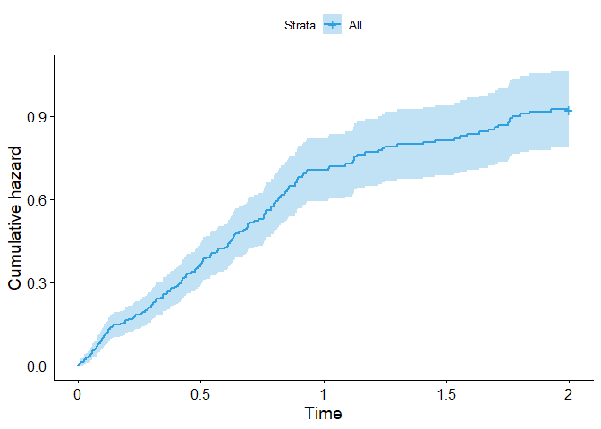
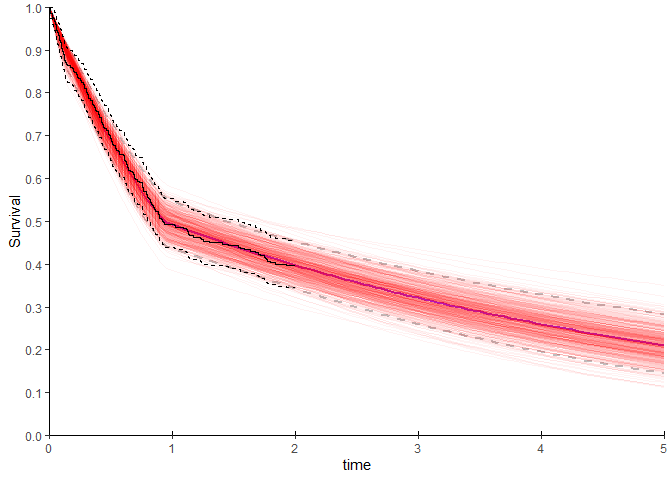
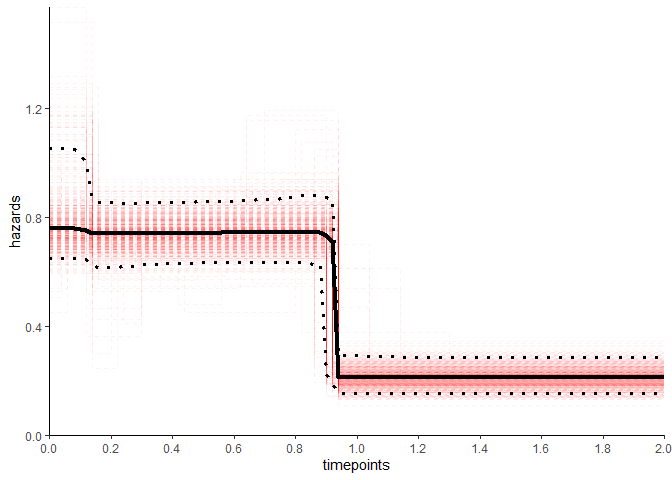
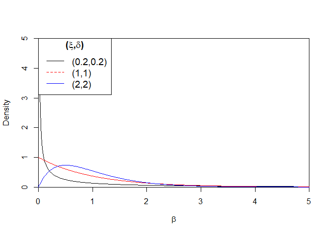

README
================

# PiecewiseChangepoint

<!-- bookdown::html_document2: default -->
<!-- bookdown::pdf_document: default -->

The goal of PiecewiseChangepoint is to estimate the number and locations
of change-points in pieceise exponential models.

## Installation

You can install the released version of PiecewiseChangepoint from
[GitHub](https://github.com/Anon19820/PiecewiseChangepoint) with:

``` r
devtools::install_github("Anon19820/PiecewiseChangepoint")
```

## Worked Example

First we load the package and simulate some piecewise exponential data.

``` r
library(PiecewiseChangepoint)

## basic example code

set.seed(123)
n_obs =300
n_events_req=300
max_time =  2

rate = c(0.75,0.25)
t_change =1

df <- gen_piece_df(n_obs = n_obs,n_events_req = n_events_req,
                   num.breaks = length(t_change),rate = rate ,
                   t_change = t_change, max_time = max_time)
```

We see the output of this dataframe below:

    ##      time_event status        time
    ## 294 0.001101298      1 0.001101298
    ## 105 0.005823161      1 0.005823161
    ## 259 0.007755478      1 0.007755478
    ## 188 0.010529899      1 0.010529899
    ## 229 0.022321679      1 0.022321679
    ## 197 0.023591679      1 0.023591679

*time\_event* represents the time the event would occur at in the
absence of censoring, while *time* is minimum of the censoring time and
the event time. *status* is an indicator variable if the event occurred
at the corresponding time or if it was censored. Plotting this survival
function we see a potential change in the hazard at around year 1.

<!-- -->

As noted in ([Bagust and Beale 2014](#ref-Bagust.2014)), constant
hazards are linear with respect to the cumulative hazard function,
therefore, the change in hazards at approximately 1 year can be seen
more clearly in this plot.

``` r
ggsurvplot(fit, palette = "#2E9FDF", fun = "cumhaz")
```

<!-- -->

Next we fit the model noting that only the time and status columns are
required.

``` r
Collapsing_Model <- collapsing.model(df,
                                     n.iter = 20750,
                                     burn_in = 750,
                                     n.chains = 2,
                                     alpha.hyper = 1,
                                     beta.hyper1 = 1,
                                     beta.hyper2 = 1)

```

As we would expect the one change-point model has the highest posterior
probability.

``` r
print(Collapsing_Model)
```

    ## Posterior Change-point Probabilities:
    ##        1         2         3         4         5         6  
    ## 0.720600  0.219825  0.050400  0.007950  0.000950  0.000275  
    ## 
    ## Summary of 1 change-point model:
    ## 
    ##   changepoint_1     lambda_1          lambda_2        
    ##   Min.   :0.7651    Min.   :0.4822    Min.   :0.0964  
    ##   1st Qu.:0.9196    1st Qu.:0.7078    1st Qu.:0.1880  
    ##   Median :0.9318    Median :0.7486    Median :0.2133  
    ##   Mean   :0.9252    Mean   :0.7507    Mean   :0.2159  
    ##   3rd Qu.:0.9318    3rd Qu.:0.7917    3rd Qu.:0.2409  
    ##   Max.   :1.2486    Max.   :1.0568    Max.   :0.4006

We should investigate the mixing of the chains to ensure they are
satisfactory. The plot below indicates that is the case with jumps
between models occurring frequently. This is an advantage of the method
as other methods such as Reversible Jump Markov Chain Monte Carlo
(RJMCMC) ([Green 1995](#ref-Green.1995)) require careful consideration
of a bijective function to move between model dimensions. Often it is
difficult to find such an appropriate bijective function which provides
frequent jumps between models and therefore convergence can be quite
slow.

``` r
chain.mixing(Collapsing_Model)
```

<!-- -->

Once we are satisfied that there is good mixing and that we have run the
model for long enough (20,000 simulations over 2 chains should be more
than enough), we may want to look at a plot of the survivor function. In
health economics we are typically interested in long term survival of
our parametric models. In this situation we want a plot of the first 5
years which we can do using the *max\_predict* argument. The red lines
show the individual posterior simulations and are a natural
representation of the parameter uncertainty.

``` r
plot(Collapsing_Model, max_predict = 5)
```

<!-- -->

Similarly we may also want to look at the hazard function. In this
situation we only present the hazard up to the maximum time observed in
the data. This is because by definition the hazard from the final
interval will be the one which is extrapolated throughout the time
horizon.

``` r
plot(Collapsing_Model, type = "hazard")
```

<!-- -->

By default the plot methods described above use all the posterior
simulations. If for example, we were only interested in the 2
change-point model, we can specify this using the *chng.num* argument.
The green points indicate the mean location of the change-points. When
plotting “all” of the simulations there is no sensible mean location of
the change-points as there are different numbers of change-points.

``` r
plot(Collapsing_Model, max_predict = 5, chng.num = 2)
```

<!-- -->

## Comparison with other survival models

In health economics we are typically interested in picking between one
of a number of alternative parametric models, although it is often
appropriate to combine all models using model averaging ([Jackson,
Sharples, and Thompson 2010](#ref-Jackson.2010)). Model fit statistics
can provide an assessment of fit to the **observed** data, although,
they do not guarantee the best fitting model will be appropriate for
extrapolation. We can compare our fitted model with 6 commonly used
parametric distributions. We fit the models using the programme JAGS
([Plummer 2003](#ref-Plummer.2003)) and compare the model fit using two
criteria Pseudo-Marginal Likelihood (PML) ([Gelfand and Dey
1994](#ref-Gelfand.1994)) and Widely Applicable Information Criterion
(WAIC) ([Watanabe 2010](#ref-Watanabe.2010)). In order to compare both
measures of fit on the same scale we take the -2log(PML) and note that
lower values indicate better fit.

``` r
#This can take up to two minutes
mod_comp <-compare.surv.mods(Collapsing_Model)

#Returns a dataframe with the model fit results
mod_comp$mod.comp
```

We see that the Piecewise Exponential model fits the data considerably
better than the other parametric models.

    ##                   Model -2log(PML)     WAIC
    ## 1           Exponential   596.4454 596.4468
    ## 2               Weibull   576.4544 576.4563
    ## 3                 Gamma   580.5258 580.5271
    ## 4            Log-Normal   568.7795 568.7674
    ## 5          Log-Logistic   566.2284 566.2297
    ## 6              Gompertz   559.8630 559.8649
    ## 7     Generalized Gamma   573.6956 573.6969
    ## 8 Piecewise Exponential   548.1396 548.1090

Because this is simulated data we know the actual event times and for
the purpose of illustration we plot this so that we can compare how the
predictions match the data. As expected the piecewise exponential model
provides an accurate fit to the data across the time-horizon.

``` r
#We have the actual event times contained with df
df_true <- df
df_true$time <- df_true$time_event
df_true$status <- 1
df_true <- df_true %>% mutate(time = ifelse(time >10, 10, time))
df_true <- df_true %>% mutate(status = ifelse(time >=10, 0, status))

#Plot the data
add_km(mod_comp$plot_Surv_all, df_true, colour = "black")
```


## Ensuring consistency when evalutating the model on different timescales

One criticism of methods which employ marginal likelihood for the
purpose of model selection is that marginal likelihood is sensitive to
the
[prior](https://www.youtube.com/watch?v=kisFIbkfDUs&ab_channel=BenLambert).
This is distinct from the posterior distribution of the parameters which
in the presence of sufficient data will dominate a (suitably vague)
prior.

The prior on the hazard is *λ* ∼ 𝒢(*α*, *β*) where *α*, *β* are the
shape and rate of the Gamma distribution. To improve the robustness of
the results and incorporate uncertainty from this parameter we can
introduce hyperpriors on *β* which is also assumed to be generated from
a gamma distribution *β* ∼ 𝒢(*ξ*, *δ*).

However, to ensure that there is no discrepancy between the model
selection using two different timescales, we need to take care when
selecting *α*, *ξ* and *δ*. We strongly recommend to keep *α*, *ξ* at
their default values of 1, which results in an exponential prior
distribution for both *λ*, *β*. Therefore the only value which will need
to change is *δ*. When we are changing timescales from years to days we
need the gamma prior for *β* to be scaled by 1/365 (i.e. the number of
days in a year). Owing to the properties of the gamma distribution the
equivalent scaled distribution is a 𝒢(1, 1/365). When this prior is used
we obtain very similar (differences due to Monte-Carlo error) posterior
change-point probabilities. Although we suggest that *ξ* (and *α*)
should be set to 1 we see from the below plot that a 𝒢(1, 1)
distribution is similar to 𝒢(2, 2) distribution. Both have an expected
value of 1 with variances 1 and 0.5 respectively and will give very
similar inferences. However, it should be clear that both distributions
are different to the 𝒢(0.2, 0.2) distribution. Even in the presence of
these different priors the posterior probability for the one
change-point model is  ≈ 70% for the simulated dataset introduced in the
first section.

<!-- -->

# References

<div id="refs" class="references csl-bib-body hanging-indent">

<div id="ref-Bagust.2014" class="csl-entry">

Bagust, Adrian, and Sophie Beale. 2014. “Survival Analysis and
Extrapolation Modeling of Time-to-Event Clinical Trial Data for Economic
Evaluation: An Alternative Approach.” *Medical Decision Making* 34 (3):
343–51. <https://doi.org/10.1177/0272989X13497998>.

</div>

<div id="ref-Gelfand.1994" class="csl-entry">

Gelfand, A. E., and D. K. Dey. 1994. “<span class="nocase">Bayesian
Model Choice: Asymptotics and Exact Calculations</span>.” *Journal of
the Royal Statistical Society. Series B (Methodological)* 56 (3):
501–14.

</div>

<div id="ref-Green.1995" class="csl-entry">

Green, Peter J. 1995. “Reversible Jump Markov Chain Monte Carlo
Computation and Bayesian Model Determination.” *Biometrika* 82 (4):
711–32.

</div>

<div id="ref-Jackson.2010" class="csl-entry">

Jackson, C. H., L. D. Sharples, and S. G. Thompson. 2010. “<span
class="nocase">Structural and parameter uncertainty in Bayesian
cost-effectiveness models</span>.” Journal Article. *J R Stat Soc Ser C
Appl Stat* 59 (2): 233–53.
<https://doi.org/10.1111/j.1467-9876.2009.00684.x>.

</div>

<div id="ref-Plummer.2003" class="csl-entry">

Plummer, Martyn. 2003. “JAGS: A Program for Analysis of Bayesian
Graphical Models Using Gibbs Sampling.” *3rd International Workshop on
Distributed Statistical Computing (DSC 2003); Vienna, Austria* 124
(April).

</div>

<div id="ref-Watanabe.2010" class="csl-entry">

Watanabe, Sumio. 2010. “Asymptotic Equivalence of Bayes Cross Validation
and Widely Applicable Information Criterion in Singular Learning
Theory.” *J. Mach. Learn. Res.* 11 (December): 3571–94.

</div>

</div>
